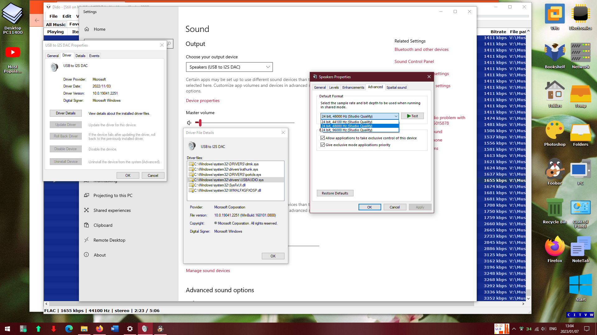

# STM32F411 PCM5102A 24bit USB Audio DAC

This is an inexpensive USBAudioDAC that supports 24-bit audio at 44.1kHz, 48kHz or 96kHz. It uses an STM32F411 Black Pill with a PCM5102A module.
It is based on [**STM32F4xx USB to I2S DAC Audio Bridge**](https://github.com/har-in-air/STM32F411_USB_AUDIO_DAC) and the [**issue as discussed here**](https://github.com/har-in-air/STM32F411_USB_AUDIO_DAC/issues/7).

The volume control code modifications as discussed in the issues linked above, was added to the windows port also as linked to above. The Windows 10-based STM32CubeIDE project is here as F411_USB_I2S.zip and the binaries are in build.zip - the hex file can directly be uploaded via the STM32CubeProgrammer and a standard ST-Link.

The USB DAC with the volume control identifies as PCM5102A DAC and the older non-volume version as USB to I2S DAC - refer to the screen dump shown below.

 
 
 

There does not seem to be any issues when playing higher defintion material in windows 10 using the DAC

The [**STM32F11 can be obtained here**](https://www.robotics.org.za/STM32F411CEU6-MOD) and the [**PCM5102A DAC module here**](https://www.robotics.org.za/PCM5102?search=pcm5102).

 
 

