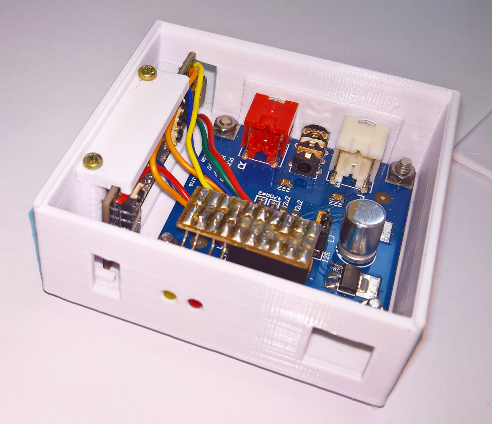

# STM32F411 PCM5102A 24bit USB Audio DAC

This is an inexpensive USBAudio DAC that supports 24-bit audio at 44.1kHz, 48kHz or 96kHz. It uses an STM32F411 Black Pill with an i2s PCM5102A DAC module.
It is based on this [**STM32F4xx USB to I2S DAC Audio Bridge**](https://github.com/har-in-air/STM32F411_USB_AUDIO_DAC) and the [**issue as discussed here**](https://github.com/har-in-air/STM32F411_USB_AUDIO_DAC/issues/7).

The volume control code modifications as discussed in the issues linked above, was added to the windows port as linked above. The Windows10-based STM32CubeIDE project is here as F411_USB_I2S.zip and the binaries are in build.zip - the hex file can directly be uploaded via the STM32CubeProgrammer and a standard ST-Link. Note that the license applicable is the original source code license. 

The [**current source**](https://github.com/har-in-air/STM32F411_USB_AUDIO_DAC/issues/14) build binaries are included here as build-24March2023.zip, built with STM32CubeIDE version 1.12. Previous source (Feb 2023) binaries are here as build-linux3.tar.gz (Linux Mint 21.1 with STM32CubeIDE 1.11.2), and build-win10.zip (based on project files STM32F411_USB_AUDIO_DAC-win10.zip), built on windows 10 using the same version of STM32CubeIDE.

For [**detailed instructions see this document:**](https://github.com/TobiasVanDyk/STM32F411-PCM5102A-24bit-USB-Audio-DAC/blob/main/Linux-Mint-211-and-Windows-10-compiling-and-uploading-the-STM32F411-USB-Audio-DAC-firmware.pdf) Installing STM32CubeIDE in Linux Mint 21.1 and in Windows 10, and compiling and uploading the STM32F411 USB Audio DAC firmware.

The USB DAC with the volume control identifies as PCM5102A DAC and the older non-volume version as USB to I2S DAC - refer to the screen dump shown below.

<p align="left">
 
 
 
</p>

 The PCM5102A module used here does not have a hardware mute breakout pin. Two changes to bsp_audio.c results in a partial fix to provide an alternative "volume mute" - the compiled version is in MuteFix.zip. This version use only the red and green LEDs to indicate the three frequency modes - those changes are in main.c
``` 
uint8_t BSP_AUDIO_OUT_SetMute(uint8_t mute) {
	if (mute) {
		BSP_AUDIO_OUT_Pause();  // AUDIO_MUTE_ON();
		}
	else {
		BSP_AUDIO_OUT_Resume(); // AUDIO_MUTE_OFF();
		}
	return AUDIO_OK;
	}

``` 


``` 
F411    PCM5102A    LED    Description
--------------------------------------------------------------------
5V      VCC
GND     GND            
B13     BCK                I2S_BCK (Bit Clock)
B15     Data               I2S_SDI (Data Input)
B12     LRCK               I2S_WS (LR Clock)
-------------------------------------------------------------------- 
B3                 RED     Fs = 96kHz (all 220R to 3v3)
B6                 GRN     Fs = 48kHz
B9                 BLU     Fs = 44.1kHz
C13             On-board   Diagnostic
--------------------------------------------------------------------
``` 
<p align="left">
 
 
</p>

The [**STM32F11 can be obtained here**](https://www.robotics.org.za/STM32F411CEU6-MOD) or [**here**](https://botshop.co.za/products/pcm5102-dac-i2s-interface-decoder-sound-card-board-digital-audio-gy-pcm5102-phat-format-player-module-for-raspberry-pi)) and the [**PCM5102A DAC module here**](https://www.robotics.org.za/PCM5102).

<p align="left">
   


</p>

There seem to be many variations of these PCM5102A modules - where available schematics of single, double and triple (as used here) LDO regulator modules are shown below.

<p align="left">
 
 
 
</p>
